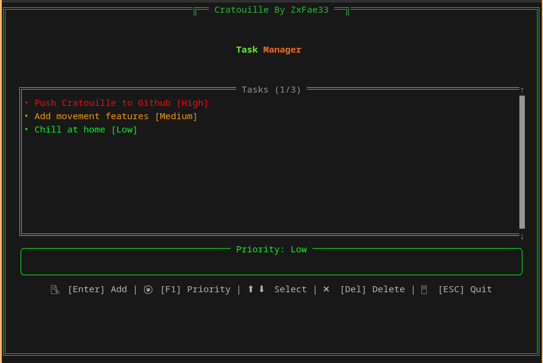

# Cratouille 0.1 - Task Manager

A lightweight, terminal-based task manager built with Rust, featuring an intuitive TUI (Text User Interface) for efficient task management.



## Features

- **Priority Management**: Three-level priority system (Low/Medium/High) with color coding
- **Intuitive Navigation**: Full keyboard control
- **Visual Feedback**: Color-coded tasks and priorities
- **Scrollable Interface**: Handle large task lists efficiently
- **Real-time Updates**: Instant visual feedback for all actions

## Installation

```bash
# Clone the repository
git clone https://github.com/zxfae/cratouille.git

# Navigate to project directory
cd cratouille

# Build the project
cargo build --release

# Run the application
cargo run
```

## Dependencies

- ratatui: ^0.29.0
- crossterm: ^0.28.1

## Usage

### Key Bindings

| Key | Action |
|-----|--------|
| Enter | Add new task |
| F1 | Cycle priority |
| ↑/↓ | Navigate tasks |
| DEL | Delete selected task |
| ESC | Quit application |

### Task Priority Colors

- 🟢 Low: Green
- 🟡 Medium: Yellow
- 🔴 High: Red

### Contributing

1. Fork the repository
2. Create your feature branch (`git checkout -b feature/NewFeature`)
3. Commit your changes (`git commit -m 'Add cool NewFeature'`)
4. Push to the branch (`git push origin feature/NewFeature`)
5. Open a Pull Request

## License

MIT License

## Acknowledgments

- Built with [Ratatui](https://github.com/ratatui-org/ratatui)
- Terminal handling by [Crossterm](https://github.com/crossterm-rs/crossterm)